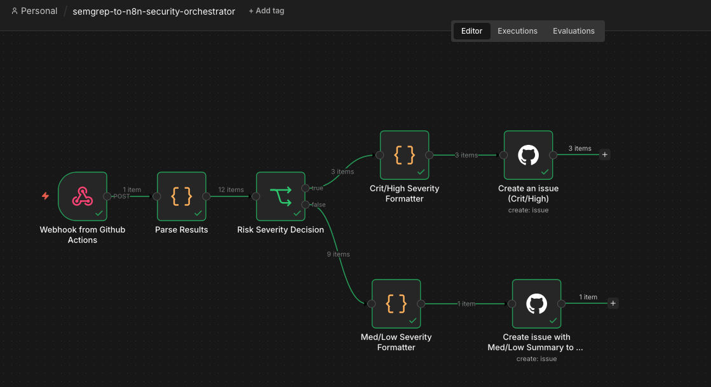

# Semgrep to n8n Security Orchestrator
### Automated Vulnerability Triage and Git-Based Remediation Routing for Developer Security Workflows

A practical Product Security automation prototype built with n8n to demonstrate how static analysis findings can be normalized, risk-classified, and automatically routed into engineering remediation backlogs.

This workflow simulates a lightweight security orchestration layer between code scanning tools and development teams, reducing manual triage overhead while preserving visibility on critical security findings.

> Note: DVNA was intentionally used as a lightweight vulnerable application target to simulate scanner findings and validate end-to-end vulnerability orchestration logic.

## Why this project

Modern engineering organizations frequently face the same Product Security bottleneck:

- security findings are generated in volume,
- developers receive fragmented scanner output,
- security teams spend excessive time manually triaging alerts,
- and critical vulnerabilities compete with low-context noise inside engineering backlogs.

This prototype was built to validate how n8n can operate as a pragmatic security automation layer capable of:

- ingesting code scanning webhook events,
- parsing raw scanner JSON findings,
- applying risk-based routing logic,
- and automatically creating developer-consumable remediation artifacts.

Rather than focusing on scanner execution itself, the goal is to demonstrate vulnerability intake orchestration and remediation enablement.

## Workflow Architecture

The workflow receives GitHub webhook events containing Semgrep JSON scan results, parses and normalizes the relevant finding metadata inside n8n, evaluates finding severity, and branches remediation handling according to risk exposure.

Critical and High findings are treated as individual engineering backlog items, while Medium and Low findings are consolidated into summarized backlog visibility to reduce developer alert fatigue and unnecessary issue sprawl.

## n8n Workflow Overview

The current implementation was intentionally scoped as a minimum viable Product Security orchestration proof of concept focused on validating the core decision points of vulnerability intake automation.

## Current MVP Flow

### 1. GitHub Webhook Listener
Receives Semgrep scan result notifications generated by GitHub Actions.

### 2. Result Parsing and Normalization
n8n extracts and formats the relevant metadata required for triage and issue generation, including:

- rule id
- finding title
- affected file path
- code snippet reference
- severity
- description
- remediation recommendation

### 3. Risk Severity Decision
Conditional logic applies differentiated routing based on security severity.

### 4. Critical / High Priority Routing
Critical and High findings generate dedicated GitHub Issues for immediate engineering visibility and remediation ownership.

### 5. Medium / Low Summary Routing
Medium and Low findings are grouped into summarized issue reporting to avoid unnecessary ticket fragmentation while still preserving backlog visibility.

## Design Decisions

### Why Semgrep

Semgrep was selected due to:

- open-source accessibility,
- highly tunable YAML-based rule definitions,
- broad public community rulesets,
- and ease of adapting scanning logic to internal secure coding standards.

This makes it a practical candidate for scalable AppSec automation use cases.

### Why Git-based Issue Routing

Engineering remediation should land where developers already operate.

GitHub Issues were intentionally used as the remediation target because Git-based platforms are the natural backlog interface for modern software teams, enabling:

- native ownership assignment,
- sprint inclusion,
- audit visibility,
- and remediation traceability.

The same pattern can be be adapted to:

- Jira,
- ServiceNow,
- Azure DevOps Boards,
- or any internal ITSM/ticketing platform using authenticated API connectors.

### Why n8n

n8n provides a lightweight and extensible orchestration layer capable of connecting security scanners, internal APIs, ticketing systems, and engineering workflows without requiring heavy SOAR infrastructure.

This makes it particularly effective for security teams that need fast operational automation with minimal engineering overhead.

## Security Engineering Rationale

This workflow was intentionally scoped as a minimum viable Product Security orchestration prototype.

The objective was not to build a full SOAR platform, but to validate the critical decision points involved in vulnerability intake automation:

- scanner result normalization,
- severity-aware routing,
- developer-facing remediation artifact creation,
- and backlog noise reduction.

The current implementation prioritizes orchestration logic over infrastructure hardening, while preserving a clear path for production-grade expansion.

## Production Hardening Opportunities

Given additional implementation time, this workflow would naturally evolve with:

- duplicate finding validation and issue deduplication,
- finding state correlation to avoid reopening already remediated vulnerabilities,
- support for additional scanner webhook sources,
- authenticated ITSM / ticketing integrations,
- webhook origin restriction and request signature validation,
- request rate limiting,
- SLA tagging and remediation deadline injection,
- repository ownership enrichment,
- and remediation status feedback loops.

These additions would transform the current proof of concept into a production-ready Product Security intake pipeline.

## Product Security Operational Mapping

This prototype directly reflects common Product Security operational needs such as:

- vulnerability intake normalization,
- engineering-facing remediation orchestration,
- risk-based backlog prioritization,
- reduction of manual triage effort,
- developer workflow enablement,
- and scalable security visibility across distributed repositories.

The objective is not simply automation for automation’s sake, but enabling security findings to become actionable engineering work with minimal friction.

## Demo Walkthrough

A short end-to-end demonstration of the workflow is available here:

👉 https://youtu.be/ONs2RsDuWzU

## Repository Scope

This repository was intentionally developed as a practical Product Security orchestration MVP focused on demonstrating workflow logic, security process viability, and engineering backlog automation using n8n.

It is not intended to represent a fully production-hardened SOAR implementation, but rather a fast security automation validation built around real-world AppSec operational patterns.

## Author

 Luis S

 Senior Product Security Engineer | Application Security | Vulnerability Engineering | DevSecOps
